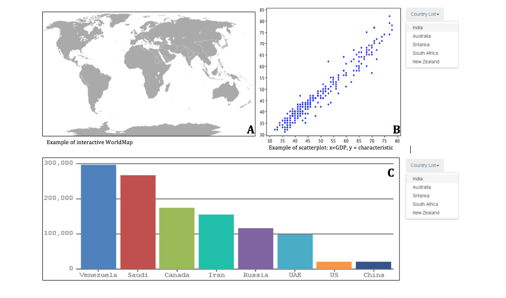

#**Design document**
Stijn Robben
 
10559558
 
 
In dit document wordt een meer technische blik geworpen op de welvaart-visualisatie voordat er daadwerkgelijk gecodeerd wordt. De visualisatie wordt in delen opgedeeld en van elk deel van de visualisatie wordt apart besproken hoe deze geimplementeerd gaat worden. 
 
 
Opmaak van de top-page sectie: 
 

 
In dit simpele deel van de visualisatie opmaak zal te titel te zien zijn met daaronder een korte beschrijven van de visualisatie en uitleg over de motivatie voor het maken van de visualisaties. Grote kans dat deze text nog gaande weg zal worden aangepast. 
 
 
Opmaak van de visualisatie zelf:
 

 
Dit is het deel van de visualisatie waar het uiteindelijk om zal draaien. Dit stuk bestaat uit 3 delen die in de afbeelding aangegeven zijn met A,B en C. 
 
###### Uitleg visualisatie A
Dit is de interactieve wereldkaart. Deze zal dusdanig interactief zijn dat de gebruiker op de landen van de wereldkaart kan klikken en vervolgens de visualisaties van B en C kan zien van dat land. In visualisatie A zijn de landen gekleurd aan de hand van hun GDP-waarde, zo kan de gebruiker zich makkelijk orienteren welke landen eventueel interessant zouden zijn om te onderzoeken. Voor deze visualisatie zal gebruik worden gemaakt van een standaard kaart zoals eerder is gebruikt in de dataprocessing opdrachten (http://datamaps.github.com/scripts/datamaps-all.js). Belangrijk bij dit deel is dat bij zo'n "on click event" de andere visualisaties data weergeven van juist dit specifieke land. Er zal dus een code moeten worden meegegeven aan visualisatie B en C die aangeeft om welke data het gaat, hiervoor zal de landcode van elk land worden gebruikt. Een ander belangrijk aspect van deze visualisatie is het feit dat deze niet in Jqeury formaat geschreven zal worden. Uit eerder opdrachten is gebleken dat dit niet het ideale formaat is voor een visualisatie van deze vorm. - EDIT: vandaag tijdens de stand-up goede feedback gekregen. Groepsgenootjes zeggen dat het met JQUERY gewoon mogelijk is om alles te implementeren zoals hierboven is beschreven. Deze wereldkaart visualisatie zal dus als JQUERY geimplementeerd worden.
 
###### Uitleg visualisatie B
Dit is het deel van de visualistatie waarbij er daadwerkelijk gekeken wordt naar een verband tussen het GDP van een land (x-as) en de eigenschappen die volgens "the school of life" alleen rijke landen toebehoren. Doormiddel van een scatterplot kan de gebruiker de mate van correlatie zien. Met behulp van het drop-down-menu kan de gebruiker switchen tussen verschillende eigenschappen, alleen tegen het GDP van een land uitgezet. Het is belangrijk om te weten dat deze visualisatie dus de scatterplot moet genereren aan de hand van de code die hij meekrijgt van de wereldkaart. Het ligt daarom voor de hand om van de d3-scatterplot een functie te maken die telkens aan de hand van de klik van een gebruiker bepaalde data als argument mee krijgt. Hierdoor kan de functie telkens andere data gebruiken en deze gebruiken om alles goed mee te schalen en af te stellen. Hetzelfde geldt voor de manier waarom de scatterplot veranderd met behulp van het drop-down-menu. Ook dit zal afhangen van de code die wordt meegegeven. Er moet nog besproken worden in welke vorm de data het beste kan hebben, wil het goed te gebruiken zijn voor deze visualisaties.
 
###### Uitleg visualisatie C
Qua specificaties komt visualisatie C grotendeels overeen met B, afgezien van het feit dat het een barchart is. Een ander aspect waarin ze vergelijkbaar zijn, zijn de opties binnen het drop-down-menu. Ook hier kan de gebruiker weer switchen tussen de verschillende eigenschappen. Hetgeen waar ze in verschillen is dat met C de data van een land vergeleken kan worden met data van andere landen. Het is nog onduidelijk met welke landen de data van het selecteerde land vergeleken zal worden. Eerst is het zaak dat alle eerder genoemde interactieve delen werken voordat hier aandacht aan wordt geschonken. Verder zal deze visualisatie redelijk veel overkomen met die van B. Ook deze zal als een functie geschreven worden die als argument de juiste dataset meekrijgt. 
 
###### Data verkrijgen
De data zal voornamelijk verkregen worden van Worlddatabank.com. Ook wordt er gebruik gemaakt van de doingbusiness.org voor het verkijgen van informatie over de betrouwbaarheid van contracten per land. De structuur van de uiteindelijke datasets wordt de grootste crux van de visualisaties en is vooralsnog niet duidelijk. 