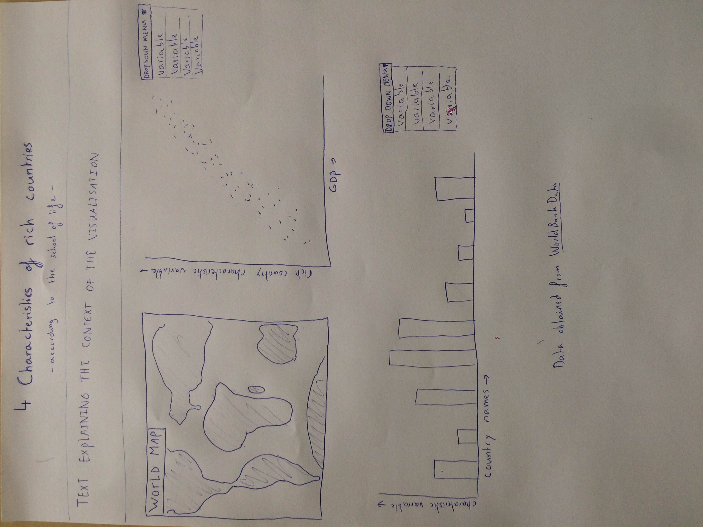

# **project welvaart**

Stijn Robben
 
10559558

## *Proposal + samenvatting*
In deze [video](https://www.youtube.com/watch?v=Y9zThcMJzQU) stelt "the school of life" dat rijke landen bepaalde eigenschappen bezitten.
De vraag die de visualisatie probeert te beantwoorden is welke van deze eigenschappen het meeste bijdragen aan de rijkdom van een land en of deze eigenschappen uberhaupt wel correleren met landelijke rijkdom. het doel is om uiteindelijk al deze aangegeven eigenschappen van landen te vergelijken met hun GDP om zo te achterhalen of deze daadwerkelijk effect hebben op de rijkdom van een land Alle hieronder genoemde eigenschappen zijn voor mij een *"MVP"*, eventuele extra implementaties zijn nog niet van toepassing.
 
###### vraagstelling en oplossing
Voor het beantwoorden van deze vraag zal de correlatie tussen de het GDP van landen en de verschillende eigenschappen uiteen worden gezet in een scatterplot. Met behulp van een dropdown menu kan de gebruiker switchen tussen verschillende eigenschappen.
Ook kan men aan de hand van een barchart de waarden van bepaalde eigenschappen tussen verschillende landen vergeleken kunnen worden. Al deze visualisaties zullen aan elkaar gelinked zijn door een interactieve wereldkaart waarbij de data van een land in de barchart en scatterplot weergegeven wordt wanneer er in de wereldkaart op het land geklikt wordt. 
 
###### tekeningen

 
###### datasets
De databronnen die voornamelijk gebruikt zullen worden is [*World DataBank*](http://databank.worldbank.org/data/home.aspx). De data kan op deze manier als excel file gedownload worden om vervolgens via de converter omgezet te worden tot een JSON of CSV file.
 
###### aparte delen visualisatie
Zoals eerder vermeld bestaat de visualisatie uit 3 delen: een scatterplot, een bargraph en een interactieve wereldkaart. Met behulp van het klikken op de wereldkaart wordt er specifieke data weergegeven in de 2 andere visualisaties. Hoe deze exact met elkaar interacteren is nog niet duidelijk.
 
###### API's
Vooralsnog is de enige API die nodig is voor deze visualisatie de wereldkaart.
 
###### eventuele problemen
Het grootste probleem zal waarschijnlijk zijn om de data in een juiste vorm te krijgen zodat alle interactiviteit juist werkt. Het klikken op de kaart moet juiste informatie meegeven aan de 2 andere visualisaties, daarom is het noodzakelijk om de data in een juiste structuur te hebben.
 
###### gelijksoortige applicaties
In gelijksoortige applicaties valt vooral op dat men de code voor de interactieve wereldkaarten niet schrijft in de JQUERY vorm. In eerdere opdrachten van dataprocessing heb ik de code voor deze kaart wel in JQUERY geschreven. Dus wellicht is het verstandig om dit eerst om te schrijven voordat ik door ga. 
