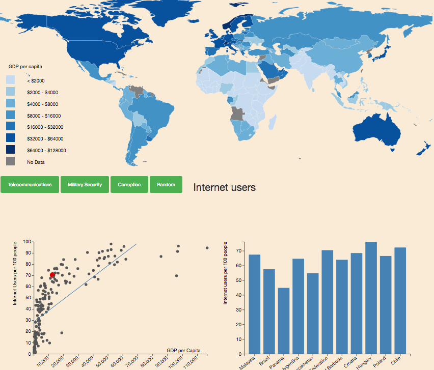

# **project welvaart**
 
Stijn Robben 
10559558
 
### Beschrijving visualisatie
In mijn visualisatie test ik of de beweringen die de organisatie "the school of life" maken, kloppen. Ik onderzoek of rijkere landen daadwerkelijk een grotere militare zekerheid hebben, minder corruptie en betere telecommunicatieve middelen bezitten. Dit doe ik door de waarden van deze eigenschappen uiteen te zetten tegen het GDP per capita van een land in een scatterplot. Tevens kunnen landen met een gelijkwaardig GDP met elkaar vergeleken worden in een barchart. Zie afbeelding voor de opmaak van de visualisatie: 
