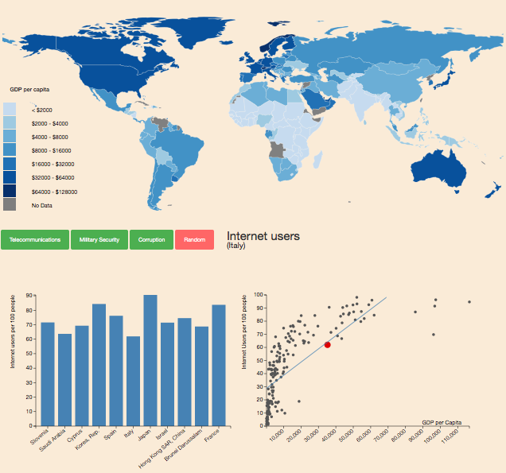

# **project welvaart**
 
Stijn Robben 
10559558
 
### (korte) Beschrijving visualisatie
In mijn visualisatie test ik of de beweringen die de organisatie "the school of life" maken, kloppen. Ik onderzoek of rijkere landen daadwerkelijk een grotere militare zekerheid hebben, minder corruptie en betere telecommunicatieve middelen bezitten. Dit doe ik door de waarden van deze eigenschappen uiteen te zetten tegen het GDP per capita van een land in een scatterplot. Tevens kunnen landen met een gelijkwaardig GDP met elkaar vergeleken worden in een barchart. Zie afbeelding voor de opmaak van de visualisatie: 
 

### Technische design
De visualisatie bestaat uit een interactieve wereldkaart, een barchart en een scatterplot. De scatterplot en barschart komen tevoorschijn en geven onderandere de data weer van het land waar de gebruikt in de wereldkaart op heeft geklikt.  
wereldkaart: 
Wanneer er op een land in de wereldkaart wordt geklikt, wordt er met de landcode en de landnaam gezocht binnen de datasets van de scatterplot en de barchart naar de data van dit land. Van het maken van de scatterplot is een functie gemaakt die wordt aangeroepen wanneer er op een land geklikt wordt. Deze functie krijgt ook een aantal argumenten mee die bepalen met welke dataset (eigenschap) de scatterplot en barcharts gemaakt worden. Wanneer deze eenmaal gemaakt zijn kan de gebruiker met 3 knoppen switchen tussen verschillende eigenschappen. Bij het klikken op deze knoppen worden weer de functies van de 2 visualisaties aangeroepen, waarbij afhankelijk van de eigenschap bepaalde argumenten worden meegegeven.  
##### Scatterplot:
Binnen de scatterplot zijn er een aantal specificaties die alleen in bepaalde gevallen op worden geroepen. Bij de datasets van corruptie en telecommunicatie kan de y-as geschaald worden van 0 tot 100, maar bij de dataset van militaire zekerheid moet dit logaritmisch. Met behulp van de argumenten die worden meegegeven bij het aanroepen van een functie wordt door middel van een if-statement gekeken of dit het geval is of niet. Ook moet de cirkel van de scatterplot die hoort bij het land waarop geklikt is gehighlight worden. Dit wordt gedaan bij het maken van de circkels. Wanneer de circel wordt gemaakt met de data die hoort bij de landcode van het geklikte land, krijgt deze een speciale class mee. In de css-file wordt de cirkel met deze class rood gekleurd. Ook is het belangrijk om duidelijk te maken wanneer een geklikt land geen data bezit. Dit wordt gedaan aan de hand van een if-statment die checkt of de data van het geklikte land "null" is. Hiernaast is er nog een tooltip met data van specifieke landen toegevoegd. Tot slot wordt er nog een trendline gemaakt en toegevoegd.  
##### Barchart:
De barchart wordt op dezelfde manier opgeroepen van voorheen beschreven. Hierbij wordt de index van het geklikte land bepaald en door middel van een for-loop worden de 5 landen met een lager GDP per capita en de 5 landen met een hoger GDP per capita in een array gezet, en worden met deze tijdelijke dataset de bars gemaakt. Het geklikte land verschijnt in het midden. Hierbij zijn de problemen met de assen, zoals beschreven bij de scatterplot, hetzelfde opgelost. Hiernaast is er nog een tooltip met data van specifieke landen toegevoegd.  
##### Knoppen: 
Bij het klikken op de knoppen worden zoals eerder gezegd de functies aangeroepen met specieke argumenten. De random-knop is een dropdown menu waarbij een extra argument wordt mee gegeven. Met dit extra argument wordt d.m.v. een if-statement een functie actief die een aantal random integeres genereerd. Met deze integers worden gebruikt als indexen en alle data met de index van de random-gegenereerde integers worden in een dataset gestopt en hiermee wordt dan een nieuwe barchart gemaakt.  
##### Problemen tijdens het proces

